# Project 4: Design Journey

Your Team Name: Gray Scorpion

**All images must be visible in Markdown Preview. No credit will be provided for images in your repository that are not properly linked in Markdown. Assume all file paths are case sensitive!**


## Client Description

We're making a new site.

Our client, Mamta is a full-time realtor and mother who enjoys selling jewelry to other moms/women at reasonable prices. The purpose of the website is to showcase jewelry to women would be interested in buying and to provide a way to contact the buyer about purchasing. She prefers simplicity and elegance to focus on the jewelry. She wants something easy to use. The she wants it to be pretty and likes a lavender color scheme.


## Meeting Notes

Our meeting notes are the following:

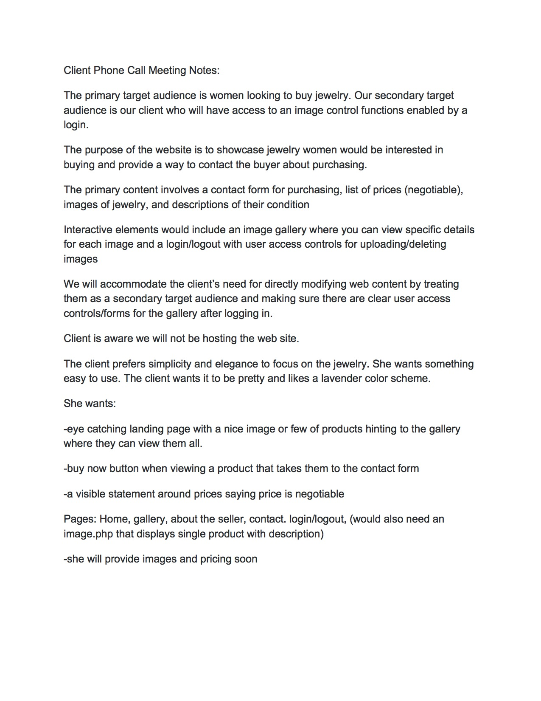

## Purpose & Content

The purpose of the website is to showcase jewelry women would be interested in buying and providing a way to contact the buyer about purchasing.

## Target Audience(s)

The primary target audience is women looking to buy jewelry. They will be browsing the images in the gallery and reading the information on the website. They will use a contact form to make purchases.
Our secondary target audience is our client who will have access to image control functions enabled by a login. Once logged in, she will be able to upload images with descriptions or delete images off the site to account for changes in inventory.


## Client Requirements & Target Audiences' Needs

Example:
- (_pick one:_) Client Requirement/Target Audience Need
  - **Requirement or Need** [What does your client and audience need or want?]
    - Client wants to cater to people who speak different languages.
  - **Design Ideas and Choices** [How will you meet those needs or wants?]
    - Create web-pages manually in multiple languages.
  - **Rationale** [Justify your decisions; additional notes.]
    - Create multiple pages in multiple languages manually.

Client Requirement:
- Client wants a simple and easy to use website
- Our design will be simple and functional, focused on portraying the products in attractive light. We will have a landing page displaying a couple images of the jewelry, navigation, and "Mamta's Jewelry"
- Design will be minimalistic but pretty to appeal to target audience

Client Requirement:
- Client wants a elegant, lavendar color scheme
- Our design will incorporate variations of lavender, white, etc.
- Color scheme will attract our target audience

Target Audience Need:
- Ability to browse all images at once while also being able to view details about a product of interest
- We will have a gallery page that generates all images (one for each product) at once that can be narrowed by a category search (necklaces, earrings, bracelets). We will also have a template image.php that will display a single product when the customer clicks on one image's link that has its additional images/product description
- A gallery with a category search and a template to view the single product details will keep user navigation easy to use and efficient


Target Audience Need:
- Means to purchase/communicate with the seller (client)
- We will create a contact form with fields: name (text), email (email), product of interest (dropdown), and other comments (text)
- Purchases are made by getting in touch with our client where they can discuss costs/jewelry


## Initial Design

.jpg)
.jpg)
.jpg)
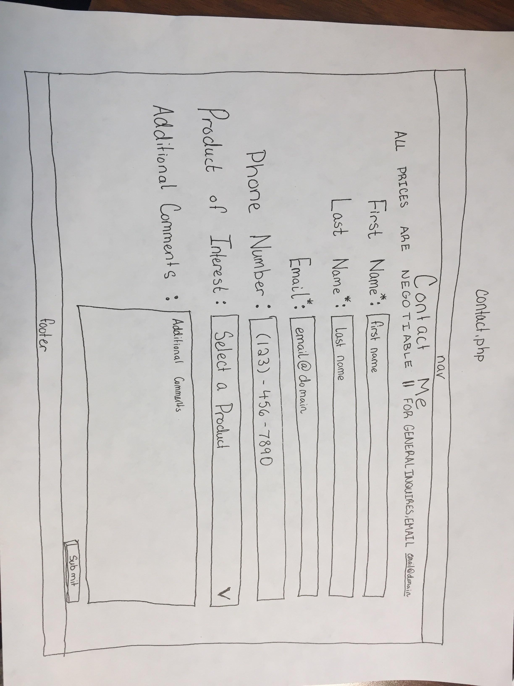
.jpg)
.jpg)
.jpg)
.jpg)
.jpg)
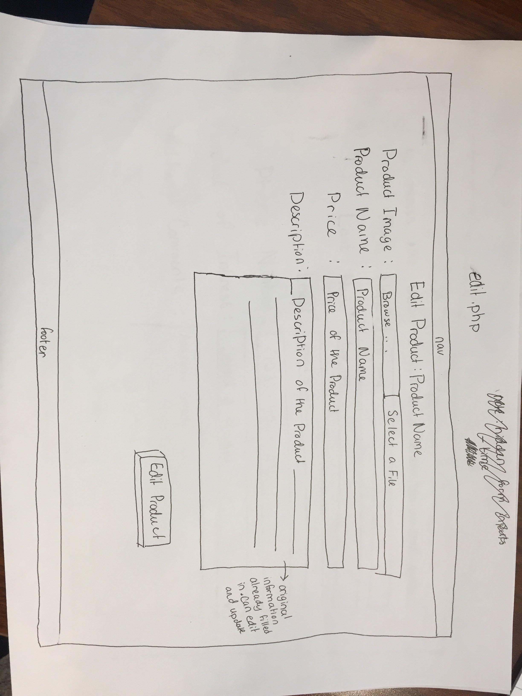


## Information Architecture, Content, and Navigation

- **Navigation**
  - Home
  - About
  - Contact
  - Shop

  - Footer
    - Admin
    - (WHEN USER IS LOGGED IN:)
      - Change password
      - Add new user
      - Delete account

- **Content** (List all the content corresponding to main navigation and sub-categories.)
  - *Home*: Shows a few showcase items/images, breif note about the site;
  - *About*: short bio of client, photo of client, email for general contact inqueries;
  - *Contact*: form for shoppers to express interst in items, fields include first name, last name, email, phone, product of interest, message/comment;
  - *Shop*: showcase all the available items, shows the item name, price, and an image for each;
  - *Individual Items*: after clicking on item in the shop, shows above fields and a description of the item and a link to buy the item. The link will direct to the contact page, with the product of interest field auto-filled;
  - *Admin*: login for client, after login can upload images, view messages sorted by date on this page. After login,client can go back to individual items to edit and delete them;
  - *Change Password*: directs user to a page with the form they can fill out to change their password. Upon completion, user is directed to confirmation page.
  - *Add new user*: directs user to a page with the form where they can supply a username and full name to create a new user account. A temporary password is supplied upon form completion. User is directed to confirmation page upon completion.
  - *Delete account*: directs user to a page asking to confirm that they want to delete their account. If they confirm, they're directed to a confirmation page.

- **Process**

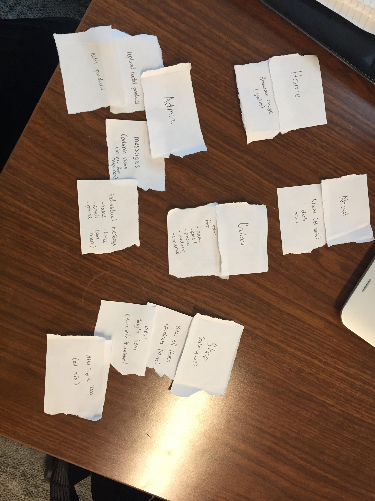
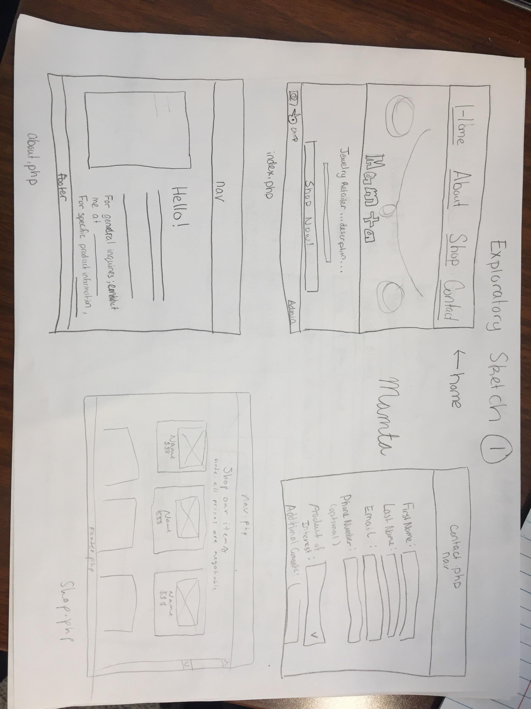
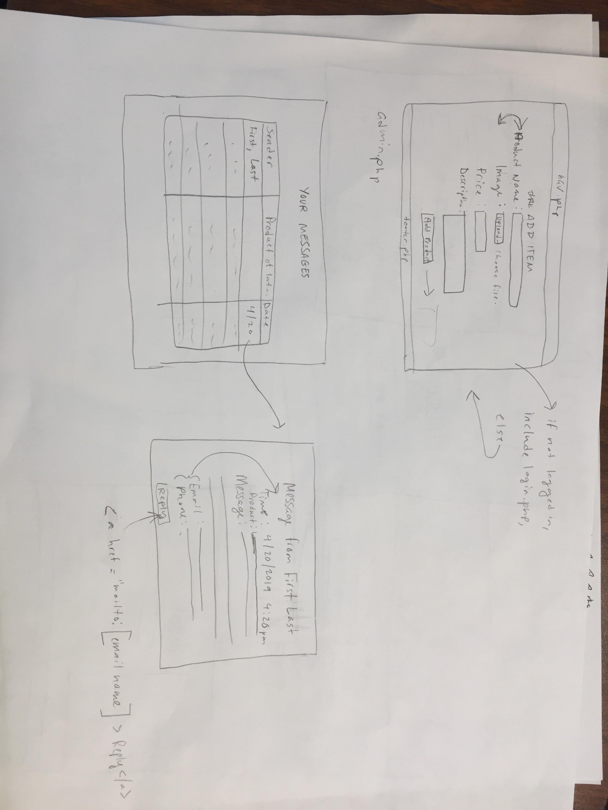
.jpg)
.jpg)
.jpg)
.jpg)

## Interactivity

Interactive pages in our site will include:

- *Photo Gallery:* Our site will feature a photo gallery similar in structure to our Project 3; site "shoppers" will be able to view all items for sale in a catalog page. This catalog page will also support searching through the catalog by type of jewelry (possible other parameters). The catalog will also support links such that each photo can be viewed on its own (with a description, etc.) -- this will be accomplished via a single_photo PHP page that displays a particular photo based on arguments passed to it (like Proj. 3). The catalog will be contained in another PHP page.

    - These pages serve as the "heart" of the website, catering primarily to our first target audience. It shows what shoppers can potentially buy!

- *User Login/Logout*: Additionally, our site will have basic login/logout functionality to support modifying photos in the gallery as it will be necessary for our client to add and remove photos as inventory changes. This aspect will require a login, top-level PHP page as well as a lot of code to handle functionality (which may be included in a login.php page or init.php). We may also include another top-level PHP page, an Admin-Home page where site admins can change their password or add other users; this is not definite though. This may be necessary, as the client will need a means for viewing messages that shoppers have submitted via the user interest form. This admin-home page would be a good place for client to view/read these messages.

    - This login/logout interactivity is only for the second target audience; it gives our client the means to access and modify the photo gallery and what's available to customers. Additionally, it may contain functionality for changing site access and accessing customer messages.

- *User interest form:* Our site will include a user form to provide users interested in making a purchase to get in contact with the seller/site admin. This form can be housed entirely in a single PHP page/file. This interest form is the front-end of our messaging system; the user enters messages in here, which are then stored on the table, which are then displayed on the admin page for the admin to read all of the user inquiries.

    - This page is meant primarily for the first target audience; it gives customers a means for expressing their interest in purchasing an article of jewelry.


Other interactive parts of our site:

- Our site will also have to have a navigation bar, and this will likely be included in a PHP include file to be included on all pages of the site. This will likely follow a structure similar to how we've done all of our previous projects.

- Likewise, our site will likely have a header and a footer included on all top-level pages which will be written in another PHP include file. It's possible (and likely) that we will decide to combine the navigation bar and header into a single include file.


## Work Distribution

Milestone 1 Who’s doing what in the design journey
- Sheel: Everything involving the client (first 5 design journey questions)
- Julia: Sketches/Initial design (Info Architecture questions)
- Amy: Sketches/Initial design
- Chris: Interactivity planning
- Justin: Work distribution/ Start coding the website (nav bar)

Deadlines
- Friday April 12th: Meeting with client about Client Requirements & Target Audiences' Needs
- Sunday April 14th: Create design for website
- Monday April 15th: Finish design journey
- Tuesday April 16th: Submit Milestone 1

Internal Dependencies
- Justin's work needs to complete the work distribution/planning first, so that the whole group is organized and can complete the milestone in a timely manner with all parts completed.
- Sheel's work needs to be done before the rest of the group can start sketching and planning because she is meeting with the client. The information she gained from the meeting will then dictate how Julia/Amy sketch the initial design of the website and how Chris will determine the interactivity of it.
- Next, Julia and Amy must complete the sketches in order for the interactivity section to be completed and to start coding the website. The sketches include information about the design layout of the website, the card sorting process, and an outline.
- Then, Chris can start planning the interactivity functionality of the website by including information about the photo gallery, user login/logout, and user interest form.
- Lastly, Justin can then start coding the website now that the initial sketches and interactivity is planned. All the pages and the nav bar should be created and functioning.


### Update for Milestone 2:

We're each taking on working on some of the pages for the site according to the following. Note that we are each building these pages from the ground up ourselves, so each of us is getting to plan and code the page. We're using out initial design sketches as a guide, but we are individually planning out the final details in each of our own pages.

- Sheel: admin.php, upload images, client meetings
- Julia: all.css, index.php, nav.css, init.sql
- Amy: contact.php, about.php, order.php, edit.php
- Chris: login.php, change_password.php, init.sql, init.php
- Justin: shop.php, product.php, gallery.css, nav.php

### Update since Milestone 2:

We've added the following pages (and who is working on them) since Milestone 2:

- Chris: confirmation.php (module), add_remove_user.php


## Additional Comments

None.


--- <!-- ^^^ Milestone 1; vvv Milestone 2 -->

## Client Feedback

The client gave us the following feedback:

- loves the spotlight on the home page, colors, and admin features
- doesn’t need social media links (doesn’t use them)
- confused about all the pages specifically the single templates (like viewing a single message/product) and wants to make sure its easy to navigate to get back to seeing all options
- concern: if customers are interested in more than one product, will they be able to choose multiple products of interest in the form?
- pricing table will have ranges as price values:
    - necklaces: $25-$35
    - earrings: $15-$25
    - bracelets (each): $15-$20

## Iterated Design

Based on the client's feedback, we're going to make the following changes to our design:
- get rid of social logos
- potential fix for single photo page: add an “x” in the top corner that links back to the previous page with the whole gallery
- get rid of product of interest input in the form or allow for selection of multiple things

## Evaluate your Design

I've selected **Abby** as my persona.

I've selected my persona because our primary target audience is women, potentially older and less familiar with technology, and are best represented by Abby

### Tasks

Task 1: Express interest in purchasing a blue necklace

  1. Find blue necklace
  2. Select blue necklace
  3. Order the necklace

Task 2: Add a new product

  1. Log in
  2. Complete add form


### Cognitive Walkthrough

#### Task 1

**Task name:** Express interest in purchasing a blue necklace

**Subgoal #1 : Find the necklace**

  - Will Abby have formed this sub-goal as a step to their overall goal?
    - Yes, maybe or no: [Yes]
    - Why? (Especially consider Abby's Motivations/Strategies.)

        Abby is familiar with the concept of online shopping. She knows that in order to purchase an image, you must first locate it


**Action #1A : Go to shop page (either through link on the home page, or in the navbar)**

  - Will Abby know what to do at this step?
    - Yes, maybe or no: [Yes]
    - Why? (Especially consider Abby's Knowledge/Skills, Motivations/Strategies, Self-Efficacy and Tinkering.)

        Abby will know from her previous experiences that items for sale would be listed under a shop page. The shop page can also be navigated through by either the home page or the navigation bar, making it very easy to find.

  - If Abby does the right thing, will she know that she did the right thing, and is making progress towards her goal?
    - Yes, maybe or no: [Yes]
    - Why? (Especially consider Abby's Self-Efficacy and Attitude toward Risk.)

        She will see that she has made it to the shop page because of the header and the various images and items listed


**Subgoal #2 : Select blue necklace**

  - Will Abby have formed this sub-goal as a step to their overall goal?
    - Yes, maybe or no: [Maybe]
    - Why? (Especially consider Abby's Motivations/Strategies.)

        Abby knows that she must pick the items she is interested first because of her prior experiences with online shopping


**Action #2A : Click on the thumbnail of the image**

  - Will Abby know what to do at this step?
    - Yes, maybe or no: [Maybe]
    - Why? (Especially consider Abby's Knowledge/Skills, Motivations/Strategies, Self-Efficacy and Tinkering.)

        Abby may not know that she has to ckick on the image in order to see the order link. She may be expecting a link to "order now" right with the thumbnail of her item.

  - If Abby does the right thing, will she know that she did the right thing, and is making progress towards her goal?
    - Yes, maybe or no: [Yes]
    - Why? (Especially consider Abby's Self-Efficacy and Attitude toward Risk.)

        She will see link to order the item if she clicks on the item


**Action #2B : Click the Order Now link**

  - Will Abby know what to do at this step?
    - Yes, maybe or no: [Yes]
    - Why? (Especially consider Abby's Knowledge/Skills, Motivations/Strategies, Self-Efficacy and Tinkering.)

        Abby will know that the order now link will help her to order the item. The link looks like the ones she has seen before.

  - If Abby does the right thing, will she know that she did the right thing, and is making progress towards her goal?
    - Yes, maybe or no: [Maybe]
    - Why? (Especially consider Abby's Self-Efficacy and Attitude toward Risk.)

        She will be taken to an order form in which the submit button will notify her that she is about to order an item, but this process is an unfamiliar one to her. Many other shopping websites she is used to using technology that will ask her to input her credit card information, address, etc, so she may not recognize this process.


**Subgoal #3 : Order the Necklace**

  - Will Abby have formed this sub-goal as a step to their overall goal?
    - Yes, maybe or no: [Yes]
    - Why? (Especially consider Abby's Motivations/Strategies.)

        She will know to order the necklace because it is her ultimate goal.


**Action #3A : Fill out the form**

  - Will Abby know what to do at this step?
    - Yes, maybe or no: [Yes]
    - Why? (Especially consider Abby's Knowledge/Skills, Motivations/Strategies, Self-Efficacy and Tinkering.)

        Abby has filled out other forms on the internet and is familiar with the process of filling out input fields and inputting her information.

  - If Abby does the right thing, will she know that she did the right thing, and is making progress towards her goal?
    - Yes, maybe or no: [No]
    - Why? (Especially consider Abby's Self-Efficacy and Attitude toward Risk.)

        As of now, we do not have planned any feedback messages. If she does not recieve feedback on her order, she will not know that she has successfully completed her request, and may feel the need to try to order it again.


#### Task 2 - Cognitive Walkthrough

**Task name: Add an item**

**Subgoal #1 : Log in**

  - Will Abby have formed this sub-goal as a step to their overall goal?
    - Yes, maybe or no: [Yes]
    - Why? (Especially consider Abby's Motivations/Strategies.)

        Abby is familiar with the concept of more features being available after being logged in. She will also know that she needs to be logged in to add an item if she has been breifed on this process before (as our client would be)


**Action #1A : Click Log in link in the footer**

  - Will Abby know what to do at this step?
    - Yes, maybe or no: [Maybe]
    - Why? (Especially consider Abby's Knowledge/Skills, Motivations/Strategies, Self-Efficacy and Tinkering.)

        Abby will know that to get to the log in page, she must identify a link that says log in. This link is semi-discrete in the footer, but Abby will still be able to find it, especially if she has been breifed on its location beforehand. If Abby is not told beforehand where the login link is, she may have some difficulty finding it.

  - If Abby does the right thing, will she know that she did the right thing, and is making progress towards her goal?
    - Yes, maybe or no: [Yes]
    - Why? (Especially consider Abby's Self-Efficacy and Attitude toward Risk.)

        Abby will see the login form, which is familiar to her

**Action #1B : Fill out log in form**

  - Will Abby know what to do at this step?
    - Yes, maybe or no: [Yes]
    - Why? (Especially consider Abby's Knowledge/Skills, Motivations/Strategies, Self-Efficacy and Tinkering.)

        Abby is very familiar with how to log in on websites and this form looks like what she knows.

  - If Abby does the right thing, will she know that she did the right thing, and is making progress towards her goal?
    - Yes, maybe or no: [Yes]
    - Why? (Especially consider Abby's Self-Efficacy and Attitude toward Risk.)

        She will see her input in the form, under the proper fields. Her password will appear covered, as she expects it.

**Action #1C : Submit log in form**

  - Will Abby know what to do at this step?
    - Yes, maybe or no: [Yes]
    - Why? (Especially consider Abby's Knowledge/Skills, Motivations/Strategies, Self-Efficacy and Tinkering.)

        Abby is very familiar with how to log in on websites and this process looks like what she knows.

  - If Abby does the right thing, will she know that she did the right thing, and is making progress towards her goal?
    - Yes, maybe or no: [Yes]
    - Why? (Especially consider Abby's Self-Efficacy and Attitude toward Risk.)

        She will see access to new features, as well as the "logged in as xyz" in the footer, next to a log out link


**Subgoal #2 : Complete Add form**

  - Will Abby have formed this sub-goal as a step to their overall goal?
    - Yes, maybe or no: [Yes]
    - Why? (Especially consider Abby's Motivations/Strategies.)

        Abby will know that she must complete the add form to add her item because it is a familiar function to her.


**Action #2A : Input data for item**

  - Will Abby know what to do at this step?
    - Yes, maybe or no: [Yes]
    - Why? (Especially consider Abby's Knowledge/Skills, Motivations/Strategies, Self-Efficacy and Tinkering.)

        Abby will know she must complete the form in order to add an item because it is a familiar concept to her. She knows how to input text into forms.

  - If Abby does the right thing, will she know that she did the right thing, and is making progress towards her goal?
    - Yes, maybe or no: [Yes]
    - Why? (Especially consider Abby's Self-Efficacy and Attitude toward Risk.)

        Abby will see her data in the input fields.


**Action #2B : Submit form**

  - Will Abby know what to do at this step?
    - Yes, maybe or no: [Yes]
    - Why? (Especially consider Abby's Knowledge/Skills, Motivations/Strategies, Self-Efficacy and Tinkering.)

        Abby will know how to submit a form because it is a familiar concept to her. She knows how to click a submit button.

  - If Abby does the right thing, will she know that she did the right thing, and is making progress towards her goal?
    - Yes, maybe or no: [No]
    - Why? (Especially consider Abby's Self-Efficacy and Attitude toward Risk.)

        Currently, we do not have any feedback coded. Abby will not receive any confirmation of the success or failure of her addition and may not realize if it has been added or not.


### Cognitive Walk-though Results

One of the biggest issues we discovered was that we do not have any kind of form feedback. There are no messages for the users that tell the the outcome fo their submissions. This could be confusing to those less familiar with technology, who do not want to to take extra steps to ensure that their submission was successful. This could leave less-confident users unsure of their abilities and feeling down on themselves if they do not receive any affirmation. An easy fix to this problem is to add feedback to all forms. They would tell users if their forms were not submitted and how to fix it (ex, "Please enter your email address to contact the seller") or if the submission was successful. A successful addition of an image could show a preview of what the added image would look like on the shop page, so the user does not have to navigate to the shop page themselves to check.


## Final Design

[What changes did you make to your final design based on the results on your cognitive walkthrough?]

- We added a search function (search bar) to the gallery

The changes we made to our design are also seen here:

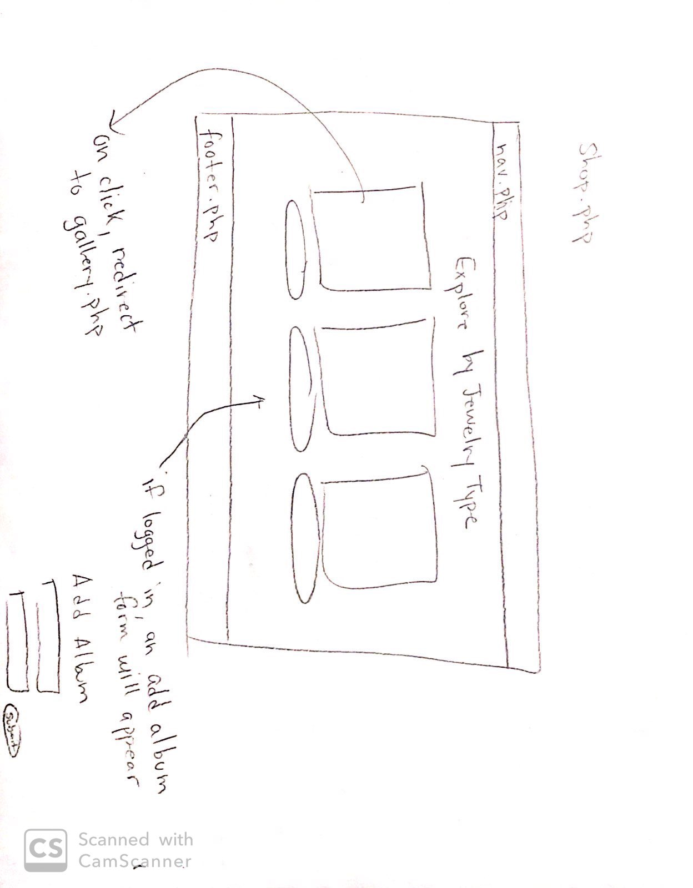
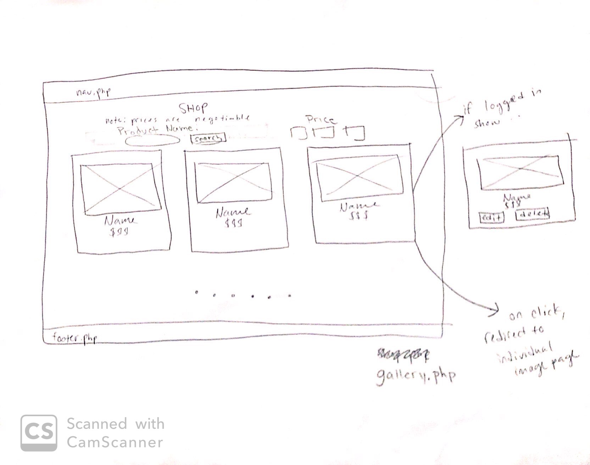
.jpg)

We've also re-worked how the login and logout functionality is implemented. Now, login.php is a module (NOT a top-level page) which is called upon from every other page (included in all pages). Thus, when a user wants to log in or log out, they are just redirected to their current page with some query string parameters to show the login page or log them out, etc. So, the final sketch for the login page is below, even though this page isn't technically its own page:

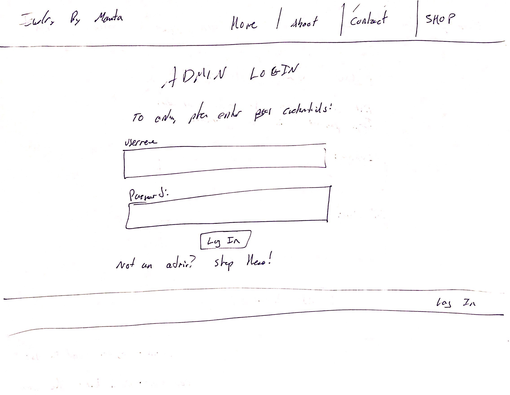

We also added the abilities for the user to change their own password, to add other user accounts, or to delete a user account. These forms will look like the following sketches (in that order). Note that the adding user form and removing user form are part of the same php file (add_remove_user.php). This change wasn't as much a product of the cognitive walkthrough as much as we wanted to include more interactivity.

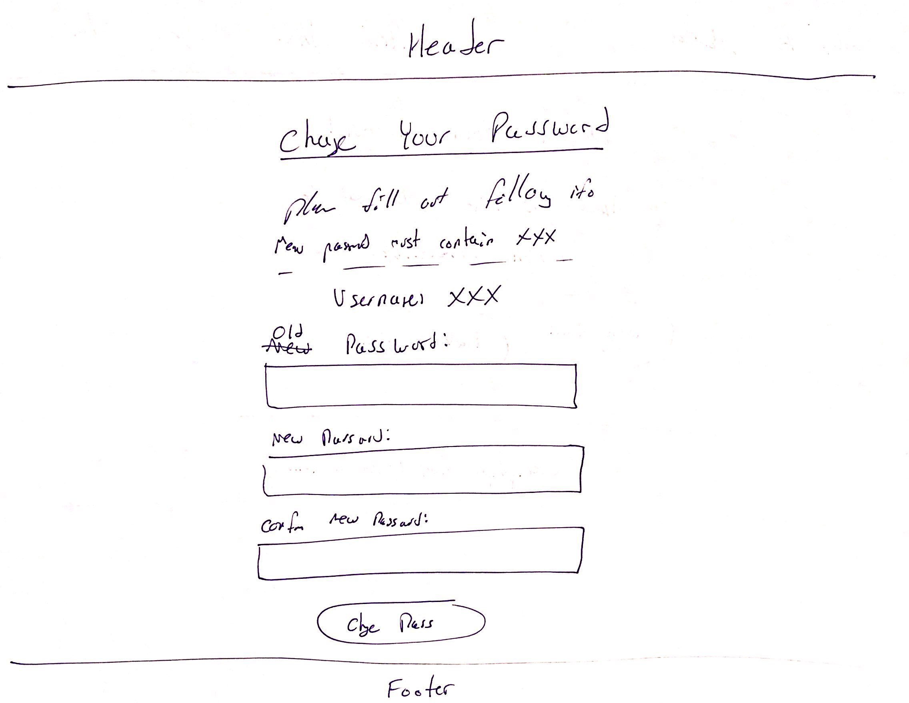
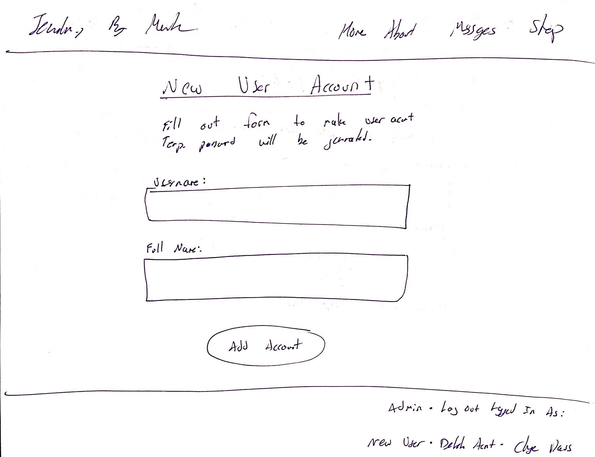
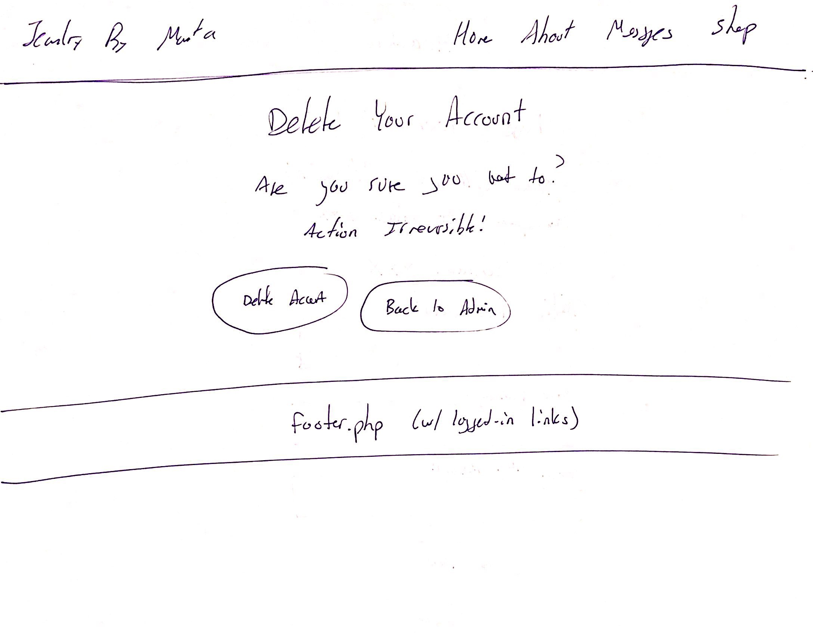

Upon successful completion of these tasks, the user is them "directed" to a confirmation page, which, like login.php, is now a module that contains all the code to display the confirmation. This makes it easy so the user doesn't have to leave whatever page they were on, it need only be refreshed with some query string parameters. So, the confirmation page will look like the following:

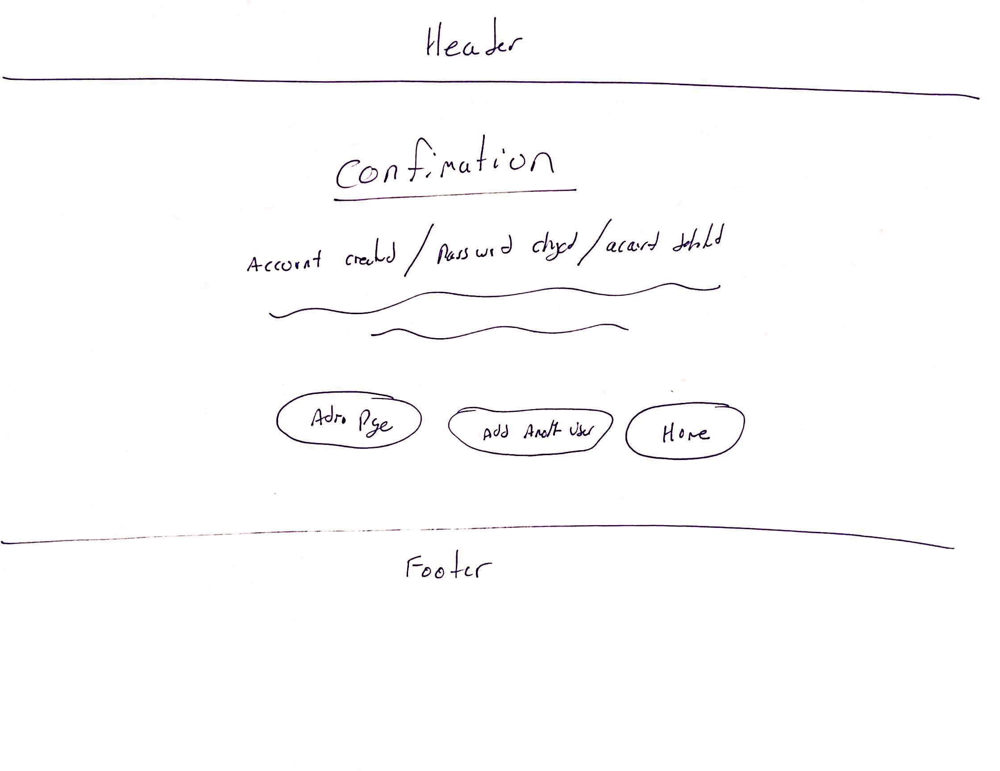

NOTE how there are 3 buttons in the sketch. This is dependent on what the confirmation is for; if the confirmation page is shown after creating a new user account, both the "Admin Page" and "Create Another User" buttons are shown. If the page is shown for completing a password change, only the "Admin Page" button is shown. If the confirmation page is for deleting an account, only the "Home" button is shown.

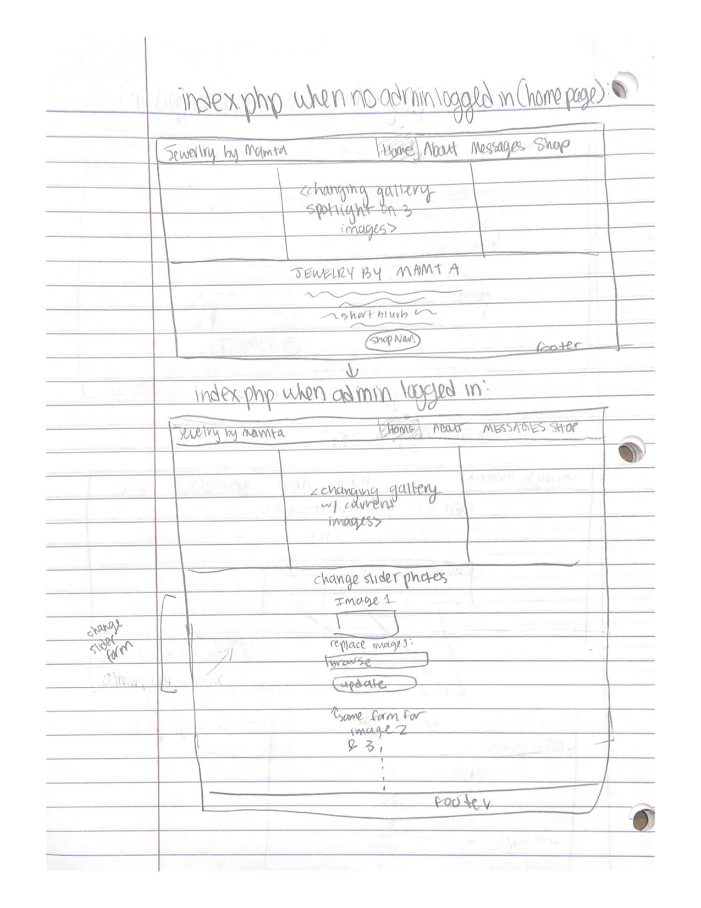

We have implemented a spotlight feature as per our client's request on the homepage that showcases three images of jewelry in a constant sliding gallery that the client can update with forms when she logs in.

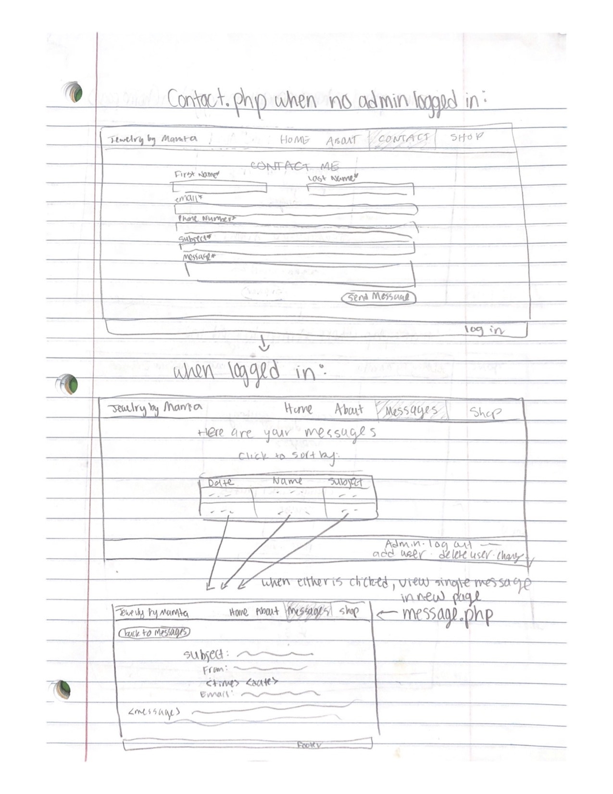

Our contact form for general inquires becomes a messages page with a table whe the client is logged in and can view messages in a separate window.


The about page serves as a way to put our client's face with her products and allow her customers to connect with her better. Our client can update the information on this page when she is logged in via a form we implemented.

## Database Schema

Our site will need a database with three tables. The user login/logout functionality will require one 'users' table, the photo gallery will require another 'photos' table, and the user-admin messaging feature we're designing will also require a 'messages' table to store user messages. Add tables have 'id' field to store unique PK for each entry.

The 'users' table will have the following schema.

```SQL
CREATE TABLE 'users' (
    'id'            INTEGER NOT NULL PRIMARY KEY AUTOINCREMENT UNIQUE,
    'name'          TEXT,
    'username'      TEXT NOT NULL UNIQUE,
    'salt'          TEXT NOT NULL UNIQUE,
    'password'      TEXT NOT NULL,
    'session'       TEXT UNIQUE
);
```
  - 'name' field is the user's full name (not required), which is used to display in the login status.
  - 'username' is the user's username.
  - 'salt' is a random 15-character alphanumeric string used for added security; this value is prepended to the plain text password and then hashed. Thus, the 'password' field is the hash (using SHA3-512) of the salt + plain password.
  - 'session' is the unique session ID that PHP generates when the user logs in.


The 'photos' table will follow the following schema:

```SQL
CREATE TABLE 'photos' (
    'id'            INTEGER NOT NULL PRIMARY KEY AUTOINCREMENT UNIQUE,
    'ext'           TEXT NOT NULL,
    'name'          TEXT NOT NULL UNIQUE,
    'price'         TEXT NOT NULL,
    'description'   TEXT,
    'product_type_id' INTEGER
);
```
  - 'name' field is the unique name of the piece of jewelry displayed in the given photo
  - 'ext' is the file extension of an image
  - 'price' field is the price of said piece
  - 'description' is a non-required description of the piece
  - 'product_type_id' is the type of jewelry's product type id


The 'messages' table will follow the following schema:

```SQL
CREATE TABLE 'messages' (
    'id'            INTEGER NOT NULL PRIMARY KEY AUTOINCREMENT UNIQUE,
    'date'          TEXT NOT NULL,
    'sender_first'  TEXT NOT NULL,
    'sender_last'   TEXT NOT NULL,
    'sender_email'  TEXT NOT NULL,
    'sender_phone'  TEXT,
    'subject'       TEXT NOT NULL,
    'message'       TEXT NOT NULL
);
```
  - 'date' is the timestamp for when the user submitted the message
  - 'sender_first', 'sender_last', 'sender_email', 'sender_phone' fields are the first name, last name, email address, and phone number for the user who submitted the message, respectively.
  - 'subject' is the subject of the message. For specific product inquiries, this field refers to the product of interest.
  - 'message' field contains the user's actual message.


The 'home_imgs' table will follow the following schema:

```SQL
  CREATE TABLE 'home_imgs' (
    'id'            INTEGER NOT NULL PRIMARY KEY AUTOINCREMENT UNIQUE,
    'file_name'     TEXT NOT NULL,
    'file_ext'      TEXT,
    'alt_txt'       TEXT NOT NULL
);
```
  - 'file_name' is the name of the home image.
  - 'file_ext' is the extension of the home image.
  - 'alt_txt' is the alt_text to the display if the home image never comes up.


The 'tags' table will follow the following schema:

```SQL
CREATE TABLE 'tags' (
    'id'            INTEGER NOT NULL PRIMARY KEY AUTOINCREMENT UNIQUE,
    'low'           INTEGER NOT NULL,
    'high'          INTEGER NOT NULL,
    'price_range'   TEXT NOT NULL UNIQUE
);
```
  - 'low' is low price bound of the price tag.
  - 'high' is high price bound of the price tag.
  - 'price_range' is the price range of the price tag.


The 'product_types' table will follow the following schema:
```SQL
CREATE TABLE 'product_types' (
    'id'            INTEGER NOT NULL PRIMARY KEY AUTOINCREMENT UNIQUE,
    'type'          TEXT NOT NULL,
    'type_low'      TEXT NOT NULL
);
```
  - 'type' is name of the product type that will be displayed in the gallery
  - 'type_low' is name of the product type in all lowercase that will be used for sql


The 'photos_tags_types' relationship table will follow the following schema:
```SQL
CREATE TABLE 'photos_tags_types' (
    'id'            INTEGER NOT NULL PRIMARY KEY AUTOINCREMENT UNIQUE,
    'photo_id'      INTEGER NOT NULL,
    'tag_id'        INTEGER NOT NULL,
    'prod_type_id'  INTEGER NOT NULL
);
```
  - 'photo_id' is the id of the photo, used as a foreign key
  - 'tag_id' is the id of the tag the photo is associated with, used as a foreign key
  - 'prod_type_id' is the id of the product type associated with the image, used as a foreign key


The 'about' table will follow the following schema:

```SQL
CREATE TABLE 'about' (
    'id'            INTEGER NOT NULL PRIMARY KEY AUTOINCREMENT UNIQUE,
    'ext'           TEXT NOT NULL,
    'name'          TEXT NOT NULL,
    'blurb'         TEXT NOT NULL,
    'opening'       TEXT NOT NULL
);
```
  - 'ext' is the ext of the about page photo
  - 'name' is the name of our client!
  - 'blurb' is the blurb that will be displayed on the about page
  - 'opening' is the welcome words right above the blurb on the about page


## Database Queries

We think we will need to use the following queries in our site. Note that the ':' parameter markers may change in the final code.

Get all photos to view in the catalog:
```SQL
SELECT * FROM photos;
```

View specific photo alone (and all details on it):
```SQL
SELECT * FROM photos WHERE (id = :photo_id);
-- May change checking condition depending on implementation!
```

Add user message to messages table for admin to view:
```SQL
INSERT INTO messages (date, time, sender_first, sender_last, sender_email, sender_phone, subject, message) VALUES (:date, :time, :sender_first, :sender_last, :sender_email, :sender_phone, :subject, :message);
```

Add a new photo to the gallery catalog:
```SQL
INSERT INTO photos (ext, name, price, description) VALUES (:ext, :name, :price, :desc);
```

Editing a photo in the gallery:
```SQL
UPDATE photos SET ext = :ext, name = :name, price = :price, description = :desc) WHERE id = :pid;
-- May change checking condition depending on implementation!
```

Deleting a photo from the gallery:
```SQL
DELETE FROM photos WHERE id = :pid;
-- May change checking condition depending on implementation!
```

Logging in a user:
```SQL
UPDATE users SET session = :session WHERE id = :user_id;
-- May change checking condition depending on implementation! If we keep the only-one-user implementation then we won't need the WHERE clause.
```

Fetching salt + password hash to compare with supplied password (check before loggin in)
```SQL
SELECT hash, password FROM users WHERE id = :user_id;
```

Changing a user's password
```SQL
UPDATE users SET password = :new_pwd WHERE id = :user_id;
-- Same condition from pervious comment applies here. I'm also thinking we should really include this guys... How is client going to initially set her password?
```

## PHP File Structure

###Top-level pages:
* index.php             - main page.
* about.php             - 'About Me' page for info about Mamta.
* admin.php             - Admin-only page for adding photos and viewing messages.
* change_password.php   - This page shows form for logged-in users to change their password.
* add_remove_user.php   - Form to either create new user account or delete the current account.
* contact.php           - Form page for user to contact Mamta
* shop.php              - Photo gallery page of items for sale
* single_photo.php      - View a single photo page (and all of its details).
* edit.php              - This page is where the admin users can edit product listings
* gallery.php           - This page gives album-specific catalog view of products
* message.php           - This page is where admin users can view a full message from users.
* order.php             - Form page for shoppers interested in purchasing.
* product.php           - For viewing a single product
* tag.php               - price-range specific catalog view

###Other PHP files:
* includes/init.php     - code that will be useful for every web page.
* includes/nav.php      - contains the navigation for pages
* includes/footer.php   - contains less-important information and a link to the admin page

* includes/login.php             - INCLUDE page to display user login form and login/logout user. Can be called upon from any top-level page.
* includes/confirmation.php      - INCLUDE page to display confirmation upon successful completion of different user actions


## Pseudocode

### index.php

This page is mostly HTML code with the following general layout:

```PHP
include init.php
include nav.php
include login.php

-- ALL HTML NECESSARY TO DISPLAY HOMEPAGE --

include footer.php
```

### footer.php

-- ALL NECESSARY HTML CODE TO DISPLAY TEXT IN FOOTER --

```PHP
if the user is logged in
  Text stating the username of the logged in user will be displayed
```

### about.php

This page is mostly HTML also with the following general layout:

```PHP
include init.php
include nav.php
include login.php

if user is logged in
  if the user submitted all the required information in the form
  Store all necessary data inputs in variables
  if the upload is successful
    Insert data into database
    if upload is successful
      Tell the user it was successful
    else
      Tell the user why the upload failed
else
  -- ALL HTML NECESSARY TO DISPLAY INFORMATION ABOUT MAMTA --

include footer.php
```

### admin.php

```PHP
include init.php
include login.php

if user is not logged in
  Redirect user to login page.
if the user submitted all the required information in the form
  Store all necessary data inputs in variables
  if the upload is successful
    Insert data into database
    if upload is successful
      Tell the user it was successful
    else
      Tell the user why the upload failed

include nav.php

-- ALL HTML NECESSARY TO DISPLAY INFORMATION ABOUT MAMTA --

include footer.php
```

*FOR THIS PAGE* I will also point out what the included javascript (admin.js) does. It is used only to refresh the messages table with a different sorting scheme. This AJAX implementation is only so the who page doesn't have to be reloaded for something as trivial as refreshing a table.

```Javascript
// This function is called by the three <a> in the headers of each column on the messages table!
function refreshTable () {
  Send header request to server with current arguments as are in the current URL adding: api=&sortby=<whatever we wanna sort by>
  Replace data in the messages table with what the server sends back
}
```

### contact.php

```PHP
include init.php
include nav.php
include login.php

if user is logged in
  if the user submitted all the required information in the form
  Store all necessary data inputs in variables
  if the upload is successful
    Insert data into database
    if upload is successful
      Tell the user it was successful
    else
      Tell the user why the upload failed
else
  -- ALL HTML NECESSARY FORM CONTACT FROM --

include footer.php
```

### edit.php/order.php

Both pages have very simialar structures

```PHP
include init.php
Create funtion to display product options
include nav.php
include login.php

-- ALL HTML NECESSARY TO DISPLAY INFORMATION ABOUT MAMTA --

Get the product names to display
if the query was successful
  Get the records
  if there are more than 0 records
    Display the records
  else
    Tell the user that are no images found in this search

include footer.php
```

### init.php

This is only for the code that was added originally to init.php. Others have since modified it.

```PHP
Initialize connection to the database with $db = ...

Check to see if user has a valid login cookie stored
if so:
  compare to session ID in dB table
  if cookie matches session ID:
    store current user record in $current_user
    reset cookie (rolling back expiration time)
  else:
    set cookie to expire immediately
    $current_user = NULL
else $current_user = NULL

$logged_in = if $current_user isnt NULL // (Boolean value)
```

### nav.php

```PHP
Create array of all titles of pages with their corresponding php file

-- ALL HTML NECESSARY TO DISPLAY INFORMATION ABOUT MAMTA --

foreach item in the array above
  Establish what page is teh current page
  if the current page is the one that is unfolded in the array loop
    Display speciall css that will demonstrate to the user that they are on the current page
  else
    Output the title of page in nav bar without special css that shows it is the current page

```

### login.php

This is what login.php will do. I have simplified this to show the thought process in the code; the actual login.php is an include file that isn't reached on its own, but called upon to display the login form, or log in a user, or logout a user with function calls from other top-level PHP files. We chose to make it this way to simplify the process of returning the user to whatever page they were on before logging in/out. If you notice, they'll never actually leave that page now!

```PHP
if POST['submit'] is set:
  // THis means user has just completed login form!
  log the user in:
    hash password supplied during form
    make sure it matches stored hash
    if so:
      Set cookie and store session ID in table
    else:
      refresh whatever page were on with instructions to call
      the login form again with error code.

else:
  // THis means user is trying to log out or needs to be shown login form.
  if user is logged in && GET action=logout is set:
    log them out & refresh current page (NOT calling login functions anymore)
  else:
    // User must want to log in, so show form!
    show login form
    display any errors if any exist from previous try
    set form action to whatever current page is!
```

### add_remove_user.php

This page is for admin users trying to delete their account or add a new one.

```PHP
If user wants to delete their account:
  show the form asking them if theyre sure
If user has confirmed:
  delete their account!
  show confirmation
If user wants to create new account:
  show the new account form!
if theyve just completed this form:
  Create new account
  Show confirmation
```

### change_password.php

This page is for users who want to change their password

```PHP
If user wants to change password (and theyre logged in):
  show the form!
If form has just been completed, attempt to change their password
  show confirmation on success
else, go back to admin.php
```

### shop.php

General layout of shop.php (page that display all of the gallery):

```PHP
include init.php
include nav.php
include login.php

-- ALL HTML NECESSARY TO DISPLAY Gallery --

if there are images in our database:
  foreach image in the photos table
    print each of them out

-- ALL HTML NECESSARY TO DISPLAY Gallery --

include footer.php
```

### product.php

General layout of product.php (which displays a single gallery item):

```PHP
include init.php
include nav.php
include login.php

  Get the number of the image clicked on
  Get photo name for photo that was clicked on
  Get photo product_type for photo that was clicked on
  Get photo ext for photo that was clicked on
  Get photo price for photo that was clicked on
  Get photo description for photo that was clicked on

  Display product name
  Display image
  Display description
  Display buy now button
    Redirect user to contact form if button is pressed

include footer.php
```

### tag.php
General layout of tag.php:

```PHP
include init.php
include nav.php
include login.php

  Get the price range of the selected tag

  Display product image
  Display name
  Display price
    Redirect user to product.php if image is pressed

include footer.php
```

### gallery.php
General layout of gallert.php:

```PHP
include init.php
include nav.php
include login.php

 if delete button is pressed, remove image from database
 if search button is pressed
    if search name is not empty then check if it is database
 if product is not in the database
    Display necessary error messages
  if it is in the databse
      Display product image
      Display name
      Display price
        if the image is pressed
          redirect user to product.php
  Display gallery

include footer.php
```


## Additional Comments

We haven't had the need to revise our team contract for this milestone; the team-contract.md file is the same we submitted originally. Our group has been working well together!

Also, take a look at the updated "Work Distribution" section at the end of the M1 part of this document; we explain how we're each taking on developing pages individually.

--- <!-- ^^^ Milestone 2; vvv Milestone 3 -->

## Issues & Challenges

Organizing the prices required a lot of synchronization across tables. The problem is ay small error causes a blank page to generate. Debugging could be tedious but having many group members made the process less tasking. Keeping data across pages seemed complicated in the beginning but after learning global pointers and storing variables in the URL we solved this. We also struggled with implementing login/logout and spent a long time finding the errors.


--- <!-- ^^^ Milestone 3; vvv FINAL SUBMISSION-->

## Final Notes to the Clients

[Include any other information that your client needs to know about your final website design. For example, what client wants or needs were unable to be realized in your final product? Why were you unable to meet those wants/needs?]
Our client was initially concerned during the earlier design processes that the website is too hard for her to navigate and all the features are too complicated but after testing, polishing the design, adding direction-based navigation buttons and including a back button to return to previous pages, she is satisfied and feels the users will find the website professional, easy to navigate and order from her. She also really likes the gallery on the homepage and the various fonts.


## Final Notes to the Graders

[1. Give us three specific strengths of your site that sets it apart from the previous website of the client (if applicable) and/or from other websites. Think of this as your chance to argue for the things you did really well.]

1. Our website is very functional in that it satisfies all of our client's needs to easily maintain an otherwise complicated system of keeping inventory of her jewelry buys/sells.
2. The CSS for images and hovering was done in a really elegant way that gives the site a professional look and a lavender color scheme that satisfies our client and compliements the jewelry without being distracting.
3. Our site has a lot of pages but is simple to navigate due to the directions and titles included after rounds user testing. Our final user tests returned great feedback on all the various tasks being easy to execute.

[2. Tell us about things that don't work, what you wanted to implement, or what you would do if you keep working with the client in the future. Give justifications.]
-when changing the password, we wanted an email notifcation to be sent for confirmation/reset link but we struggled with getting it to work perfectly. It wasn't a priority since the client said it was unnecessary so we got rid of it.
-If we had more time, we would implement a reply form for the admin to fill out a message that is sent directly to the user but our client said she prefers to use her own email to communicate


[3. Tell us anything else you need us to know for when we're looking at the project.]
In our feedback for m1 and m2 we were told to include more interactivity so we did: It was documented earlier but here is a list just in case:
-Interactive gallery on homepage where admin logged in can choose what images it displays.
-Interactive about page when admin logged in, they can fill out a new bio/picture and it generates on the about page for customers to see.
-Contact page is a form for general inquires to reach out to our client, when admin is logged in this page becomes a messages page with a table generated by data stored in the messages table and has a sort function
-messages template geerates a single messages when a message is clicked on in the messages table
-the shop page takes you through 3 categories of jewelry where you can sort by price, or search by name
-users can view a single product and its details by clicking on it and a buy now button that takes you to an order form for that product
-the shop page can be updated by the admin when logged in
-all the admin features are displayed on admin page as soon as admin logs in with buttons that take them to each page or let's you add a new product right there
-admin once logged in can add a new user account, change their password, or delete their account which will all update the database.
